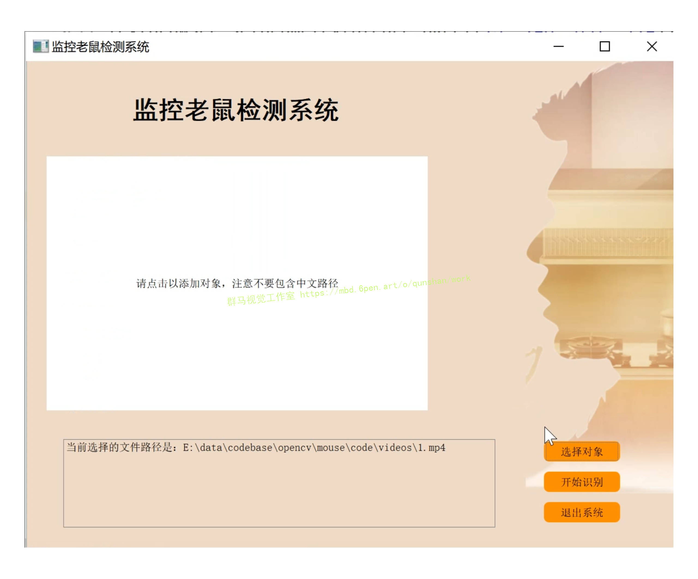
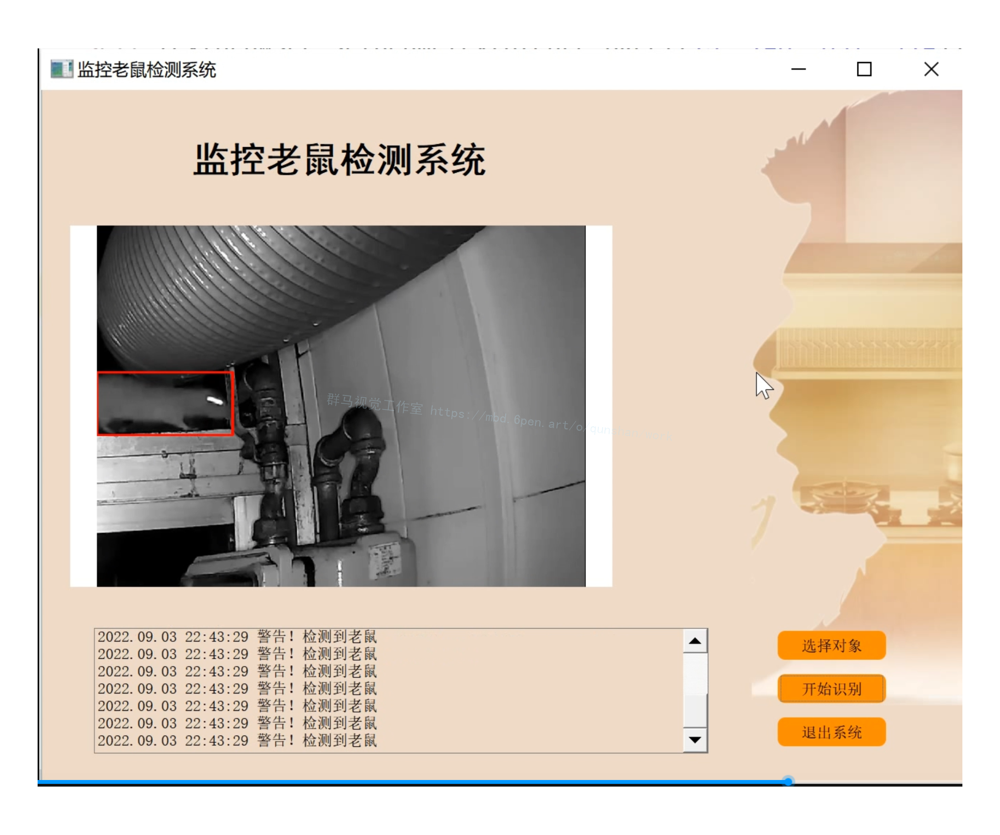
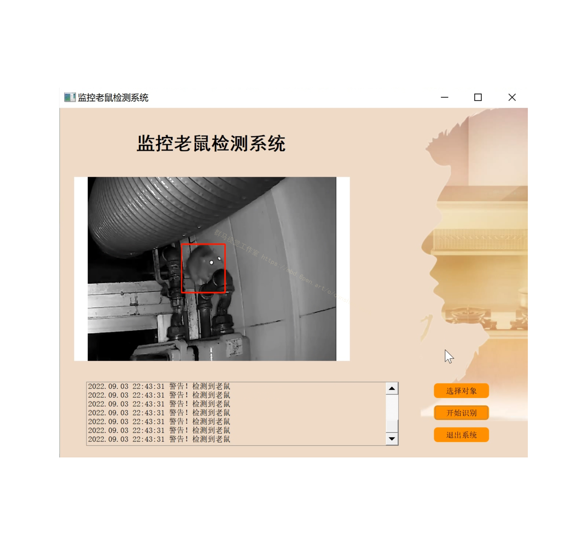
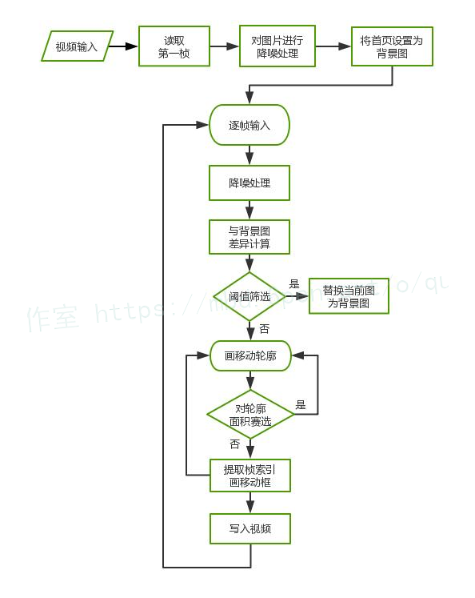
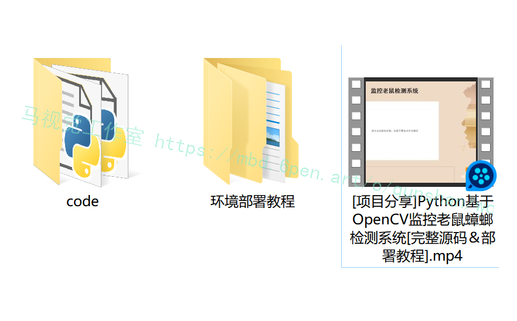


# **1.视频演示：**

[[项目分享]Python基于OpenCV监控老鼠蟑螂检测系统[完整源码＆部署教程]_哔哩哔哩_bilibili](https://www.bilibili.com/video/BV1ZG41157Pj/?vd_source=bc9aec86d164b67a7004b996143742dc)


# **2.图片演示：**







# **3.算法原理：**
[该博客提出的移动侦测即是根据视频每帧或者几帧之间像素的差异](https://afdian.net/item?plan_id=9ffe639060b911edbc3052540025c377)，对差异值设置阈值，筛选大于阈值的像素点，做掩模图即可选出视频中存在变化的桢。帧差法较为简单的视频中物体移动侦测，帧差法分为：单帧差、两桢差、和三桢差。随着帧数的增加是防止检测结果的重影。
#### [差分法(Temporal Difference)](https://mbd.pub/o/bread/Y5WWkpps)
由于场景中的目标在运动，目标的影像在不同图像帧中的位置不同。该类算法对时间上连续的两帧或三帧图像进行差分运算，不同帧对应的像素点相减，判断灰度差的绝对值，当绝对值超过一定阈值时，即可判断为运动目标，从而实现目标的检测功能。

# **4.算法流程图：**


# **5.代码实现：**
```
def threh(video,save_video,thres1,area_threh):
 cam = cv2.VideoCapture(video)#打开一个视频
 input_fps = cam.get(cv2.CAP_PROP_FPS)
 ret_val, input_image = cam.read()
 index=[]
 images=[]
 images.append(input_image)
 video_length = int(cam.get(cv2.CAP_PROP_FRAME_COUNT))
 input_image=cv2.resize(input_image,(512,512))
 ending_frame = video_length
 fourcc = cv2.VideoWriter_fourcc(*'XVID')
 out = cv2.VideoWriter(save_video,fourcc, input_fps, (512, 512))
 gray_lwpCV = cv2.cvtColor(input_image, cv2.COLOR_BGR2GRAY)
 gray_lwpCV = cv2.GaussianBlur(gray_lwpCV, (21, 21), 0)
 background=gray_lwpCV

# es = cv2.getStructuringElement(cv2.MORPH_ELLIPSE, (9, 4))

 i = 0 # default is 0
 outt=[]
 while(cam.isOpened()) and ret_val == True and i <2999:
  ## if i % 2==1:
  ret_val, input_image = cam.read()
  input_image=cv2.resize(input_image,(512,512))
  gray_lwpCV = cv2.cvtColor(input_image, cv2.COLOR_BGR2GRAY)
  gray_lwpCV = cv2.GaussianBlur(gray_lwpCV, (21, 21), 0)
  diff = cv2.absdiff(background, gray_lwpCV)
  outt.append(diff)
  #跟着图像变换背景
  tem_diff=diff.flatten()
  tem_ds=pd.Series(tem_diff)
  tem_per=1-len(tem_ds[tem_ds==0])/len(tem_ds)
  if (tem_per <0.2 )| (tem_per>0.75):
   background=gray_lwpCV
  else:
   diff = cv2.threshold(diff, thres1, 255, cv2.THRESH_BINARY)[1]
   ret,thresh = cv2.threshold(diff.copy(),150,255,0)
   contours, hierarchy = cv2.findContours(thresh,cv2.RETR_EXTERNAL,cv2.CHAIN_APPROX_SIMPLE)
  #  contours, hierarchy = cv2.findContours(diff.copy(), cv2.RETR_EXTERNAL, cv2.CHAIN_APPROX_SIMPLE)
   for c in contours:
    if (cv2.contourArea(c) < area_threh) | (cv2.contourArea(c) >int(512*512*0.3) ) :  # 对于矩形区域，只显示大于给定阈值的轮廓（去除微小的变化等噪点）
     continue
    (x, y, w, h) = cv2.boundingRect(c) # 该函数计算矩形的边界框
    cv2.rectangle(input_image, (x, y), (x+w, y+h), (0, 255, 0), 2) 
    index.append(i)
  #  cv2.imshow('contours', input_image)
  #  cv2.imshow('dis', diff)
  out.write(input_image)
  images.append(input_image)
  i = i+1
 out.release()
 cam.release()
 return outt,index,images```
##调取函数
outt=threh('new_video.mp4','test6.mp4',25,3000)
```
# **6.系统整合：**

下图[完整源码&环境部署视频教程&自定义UI界面](https://s.xiaocichang.com/s/257efe)

参考博客[《Python基于OpenCV监控老鼠蟑螂检测系统\[完整源码＆部署教程\]》](https://mbd.pub/o/qunma/work)


# **7.参考文献：**
***
*   *[1]*[红外弱小目标检测算法综述](https://kns.cnki.net/kcms/detail/detail.aspx?filename=ZGTB202009002&dbcode=CJFD&dbname=CJFDTEMP&v=rnRpPjnqSLWDWhz-76y73RennxMJMCC63eAjYbMMgzdyNewn_MaR1oWQD0mb2UOt)[J]. 李俊宏,张萍,王晓玮,黄世泽.  中国图象图形学报. 2020(09)
*   *[2]*[新型光电探测技术在精确制导武器上的应用研究(特约)](https://kns.cnki.net/kcms/detail/detail.aspx?filename=HWYJ202006026&dbcode=DKFX&dbname=DKFXTEMP&v=KpvNimGLlzS6znKVLpFaN451R7eQpXbpHNQrXNyTEmPdJEM6OtuLAIixZKuqSjcD)[J]. 宋闯,姜鹏,段磊,孙剑峰,范之国.  红外与激光工程. 2020(06)
*   *[3]*[基于FPGA的红外弱小目标检测算法](https://kns.cnki.net/kcms/detail/detail.aspx?filename=HWJS202006009&dbcode=CJFD&dbname=CJFDTEMP&v=KMA_axLyS4uSOAnAqKBuceSUAnZwXQCsIy6o83MDOcEvx18y8_xdGakZ9E3mAko4)[J]. 张延苏,吴滢跃.  红外技术. 2020(06)
*   *[4]*[一种基于差分滤波的红外舰船目标检测方法](https://kns.cnki.net/kcms/detail/detail.aspx?filename=ZHKZ202002013&dbcode=CJFD&dbname=CJFDTEMP&v=npgJx00qXazQJjhc_Llz18EWSXWWfMaA0UBoEPr2TRlwGde1vP0_7bblBd2m2kyM)[J]. 修炳楠,吕俊伟,鹿珂珂.  指挥与控制学报. 2020(02)
*   *[5]*[激光干扰红外预警卫星的有效压制区研究](https://kns.cnki.net/kcms/detail/detail.aspx?filename=JGHW202005019&dbcode=CJFD&dbname=CJFDTEMP&v=PgIZtnr_vlqzXFmj-cESOLTFgnBBlAy0ldBmc9RWkHRNXOj5K6FZo6RzylIyQy8G)[J]. 王枭,张宇令,李云成.  激光与红外. 2020(05)
*   *[6]*[基于匹配滤波的Gm-APD激光雷达三维重构算法研究](https://kns.cnki.net/kcms/detail/detail.aspx?filename=HWYJ202002021&dbcode=CJFD&dbname=CJFDTEMP&v=KpvNimGLlzRwF8U6WqFTNEPshSILyDhBzJ4q73h0rQwILk2Q8tCc8-uJUsjmMABt)[J]. 马乐,陆威,姜鹏,刘迪,王鹏辉,孙剑峰.  红外与激光工程. 2020(02)
*   *[7]*[基于改进候选区域网络的红外飞机检测](https://kns.cnki.net/kcms/detail/detail.aspx?filename=JGHW201901020&dbcode=CJFD&dbname=CJFDTEMP&v=pm7dIz7lJJSlSgb7OiQqUeR0hXGAuUF6-3il1R-T5yM7UYPH7eeyNXQ2x8QzhZPz)[J]. 姜晓伟,王春平,付强.  激光与红外. 2019(01)
*   *[8]*[红外搜索跟踪系统探测距离缩比测试方法](https://kns.cnki.net/kcms/detail/detail.aspx?filename=DGKQ201904018&dbcode=CJFD&dbname=CJFDTEMP&v=tDRCCfDRo1Ri5xRcQnOFFMOrK8xho_YM88rypMMSe4iQVTBQA1Hj6hELi-8-0PLz)[J]. 谢飞,周德召,胡磊力,杜保林.  电光与控制. 2019(04)
*   *[9]*[红外成像/被动微波复合制导技术研究](https://kns.cnki.net/kcms/detail/detail.aspx?filename=HWJS201805014&dbcode=CJFD&dbname=CJFD2018&v=x1ePX1F4xrSu7Wxc1N--XAtjD0lUnpvRfi33Ds2O9wg_woAE4nq5e9-ZZUQiftSV)[J]. 夏团结,申涛,方珉,宋敏敏,刘会文.  红外技术. 2018(05)
*   *[10]*[机载红外搜索跟踪系统有效探测区域研究](https://kns.cnki.net/kcms/detail/detail.aspx?filename=JGHW201805010&dbcode=CJFD&dbname=CJFD2018&v=UsZgNaRI7-V9WysLcmA6v8oQfjfgyI42w6G0XQhtwhRnUUM9uYLUh4DA-D8I2uWv)[J]. 王芳,罗寰,王海晏,寇添,寇人可.  激光与红外. 2018(05)


---
#### 如果您需要更详细的【源码和环境部署教程】，除了通过【系统整合】小节的链接获取之外，还可以通过邮箱以下途径获取:
#### 1.请先在GitHub上为该项目点赞（Star），编辑一封邮件，附上点赞的截图、项目的中文描述概述（About）以及您的用途需求，发送到我们的邮箱
#### sharecode@yeah.net
#### 2.我们收到邮件后会定期根据邮件的接收顺序将【完整源码和环境部署教程】发送到您的邮箱。
#### 【免责声明】本文来源于用户投稿，如果侵犯任何第三方的合法权益，可通过邮箱联系删除。